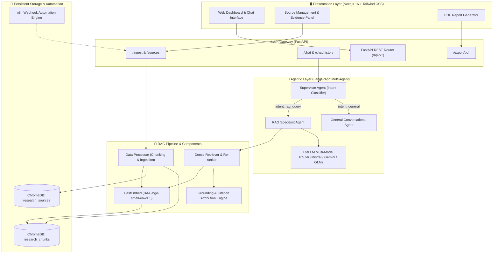
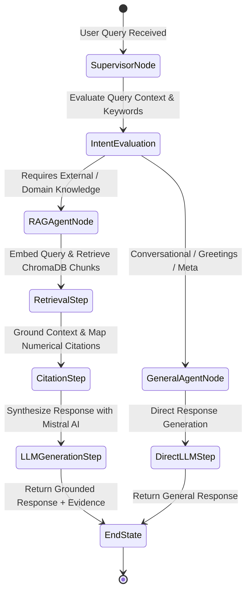
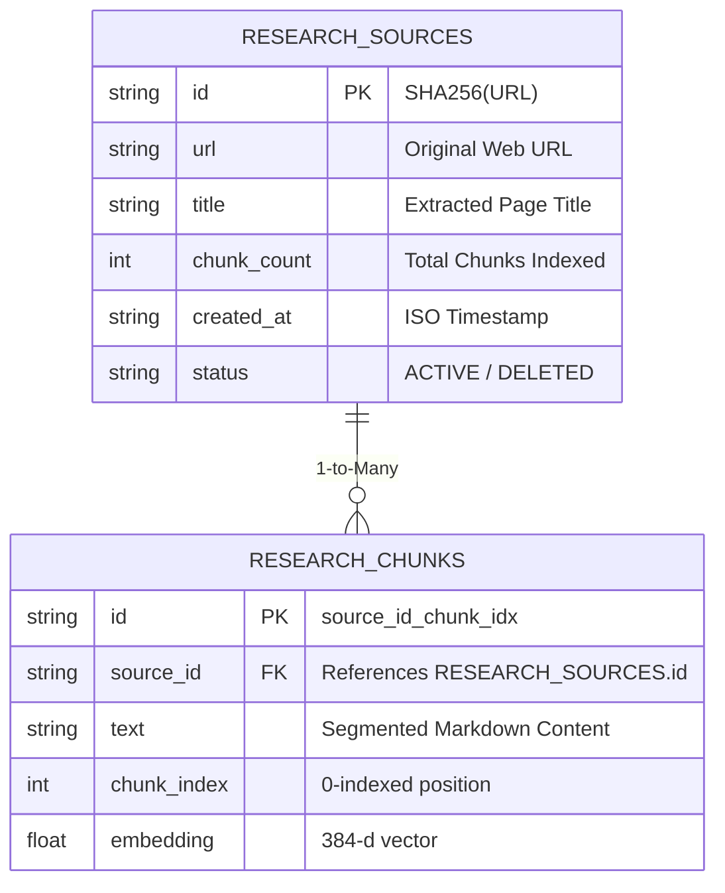

# System Architecture & Technical Specifications

> **Comprehensive architectural overview of the Research Assistant with Persistent Memory platform, detailing component interactions, multi-agent orchestration, data flows, and storage design.**

---

## 🏛️ 1. High-Level Architecture

The platform follows a modern, decoupled client-server architecture built for scalable document ingestion, agentic orchestration, persistent vector retrieval, and grounded question answering:



---

## 🧩 2. Component Breakdown

### 2.1 Backend Architecture (`Backend/src/`)

The backend is written in Python (FastAPI) and structured into modular, single-responsibility layers:

```
Backend/src/
├── agents/                      # Multi-agent orchestrators (LangGraph)
│   ├── supervisor/              # Query routing and intent classification graph
│   │   ├── graph.py             # StateGraph definition & execution
│   │   └── router.py            # Zero-shot intent categorization
│   ├── rag_agent/               # Grounded retrieval node
│   │   └── agent.py             # Context fetching, prompt formatting, LLM call
│   └── llm/                     # Resilient model abstraction
│       └── provider.py          # LiteLLM failover router (Mistral -> Gemini -> GLM)
├── rag/                         # Modular RAG subsystems
│   ├── components/
│   │   ├── data_processor/      # Chunking, FastEmbed embeddings, Ingestion pipeline
│   │   │   ├── chunking.py      # Recursive markdown chunker with overlap
│   │   │   ├── embeddings.py    # Local FastEmbed BGE-small-en ONNX runtime
│   │   │   └── ingestion.py     # Document pre-processing and validation
│   │   ├── vector_store/        # ChromaDB persistent store repository
│   │   │   ├── chroma_client.py # Thread-safe persistent Chroma client
│   │   │   └── repository.py    # Dual-collection CRUD and deduplication
│   │   ├── retrieval/           # Search & re-ranking engines
│   │   │   ├── search.py        # Cosine similarity vector search
│   │   │   └── reranker.py      # Cross-score normalization & top-k filtering
│   │   └── citations/           # Evidence verification & attribution
│   │       └── engine.py        # Citation mapper ([1], [2]) and grounding checks
│   ├── prompts/                 # Anti-hallucination prompt templates
│   │   └── templates.py         # System prompts and strict constraint templates
│   └── rag_pipeline.py          # Unified RAG orchestrator interface
├── api/                         # FastAPI routing and controllers
│   ├── routes/                  # /chat, /ingest, /sources, /health, /export
│   └── schemas/                 # Pydantic request and response contracts
├── services/                    # Business logic services
│   ├── chat_service.py          # Chat session history and multi-turn state
│   ├── ingestion_service.py     # Synchronous and async URL ingestion
│   └── source_service.py        # Source listing, counts, and purge operations
├── scraper/                     # Resilient web scraping
│   ├── fetcher.py               # User-Agent rotation, timeout handling
│   └── cleaner.py               # HTML boiler-plate stripping, Markdown preservation
└── config/                      # Settings & environment variables via pydantic-settings
```

---

## 🤖 3. Multi-Agent System (LangGraph)

The platform utilizes **LangGraph** to construct a dynamic decision graph:



### Agent Roles:
1. **Supervisor Agent (`src/agents/supervisor/`)**:
   - Inspects user input and chat history.
   - Routes to `rag_agent` if the query relates to indexed documents, research topics, or domain-specific queries.
   - Routes to `general_agent` for conversational pleasantries, formatting requests, or meta questions.

2. **RAG Agent (`src/agents/rag_agent/`)**:
   - Fetches dense vector embeddings for the query.
   - Queries ChromaDB persistent collections with similarity thresholds.
   - Formats citations (`[1]`, `[2]`, etc.) referencing exact chunk identifiers and source URLs.
   - Applies strict anti-hallucination prompt guardrails.

---

## ⚡ 4. AI & Embeddings Architecture

```
                      +-------------------------------------------------+
                      |           LiteLLM Provider Failover             |
                      +------------------------+------------------------+
                                               |
              +--------------------------------+--------------------------------+
              |                                |                                |
              v (Tier 1: Primary)              v (Tier 2: Fallback)             v (Tier 3: Fallback)
    +-------------------+            +-------------------+            +-------------------+
    |    Mistral AI     |            |   Google Gemini   |            |     Zhipu GLM     |
    | open-mistral-nemo | ===FAIL==> | gemini-2.5-flash  | ===FAIL==> |    glm-4-flash    |
    +-------------------+            +-------------------+            +-------------------+
```

### Embedding Architecture:
- **Model**: `BAAI/bge-small-en-v1.5`
- **Engine**: `FastEmbed` (ONNX Runtime)
- **Dimensionality**: 384 dimensions
- **Characteristics**: 100% local, zero latency external API overhead, zero cost, deterministic embeddings.

### LLM Orchestration:
- Unified via `LiteLLM` with transparent retry and fallback mechanisms.
- Primary Model: **Mistral AI (`open-mistral-nemo`)** with 128k context window and top-tier instruction following.

---

## 🗄️ 5. Persistent Storage & Deduplication (ChromaDB)

The vector store manages two distinct collections persisted to disk at `./data/chromadb/`:



### Deduplication Logic:
1. **URL Normalization & Hash**: Incoming URLs are stripped of tracking query params and lowercased.
2. **Content Hash Check**: SHA-256 hash of extracted text verifies if the document has changed.
3. **Additive Persistence**: If a source already exists, it is either skipped or refreshed without duplicate vector generation.

---

## 🛡️ 6. Guardrails & Anti-Hallucination

The system enforces strict hallucination boundaries:
- **System Prompt Rules**: The LLM is instructed to answer strictly from the retrieved context.
- **Strict Fallback Sentence**: If the retrieved context does not contain sufficient facts to answer the question, the system produces the deterministic phrase:
  > *"The requested information was not found in the provided source."*
- **Citation Cross-Validation**: Every factual claim maps to an explicit `[N]` reference backed by an indexed source in the Evidence Panel.
