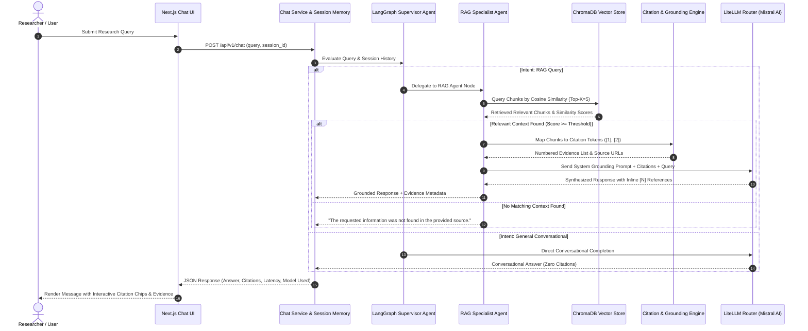
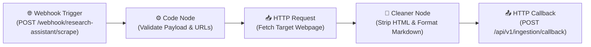
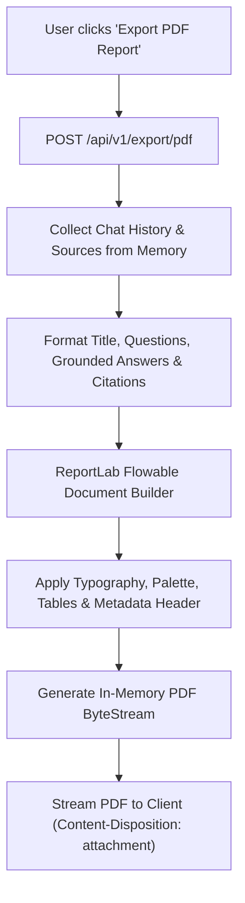
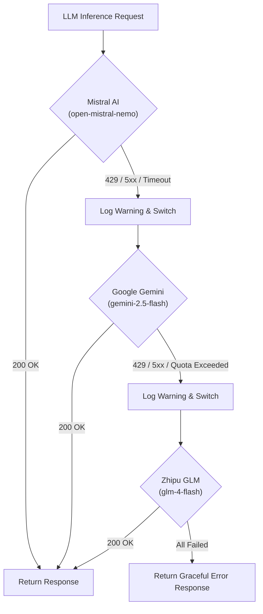

# Platform Workflows & Data Pipelines

> **End-to-end operational workflows, data pipelines, sequence diagrams, and webhook automation specifications for the Research Assistant with Persistent Memory platform.**

---

## 🔄 1. Document Ingestion & Indexing Pipeline

The ingestion pipeline transforms raw web URLs into clean, structured, embedded, and indexed vector records persisted in ChromaDB.

### Ingestion Sequence Diagram

```mermaid
sequenceDiagram
    autonumber
    actor User as Researcher / User
    participant Frontend as Next.js Client
    participant API as FastAPI Ingestion Router
    participant Scraper as Resilient Scraper (Fetcher + Cleaner)
    participant Chunker as Markdown Recursive Chunker
    participant FastEmbed as FastEmbed Local Model
    participant Chroma as ChromaDB Persistent Store

    User->>Frontend: Enter Target URL(s)
    Frontend->>API: POST /api/v1/ingest (URLs list)
    API->>Scraper: Fetch Webpage with Header Rotation
    Scraper-->>API: Raw HTML Content
    API->>Scraper: Clean HTML & Convert to Markdown
    Scraper-->>API: Clean Markdown Text + Page Metadata
    
    API->>Chunker: Split Text (800 chars, 150 overlap)
    Chunker-->>API: List of Chunks + Headings Metadata
    
    API->>FastEmbed: Generate 384-d Dense Embeddings
    FastEmbed-->>API: Vector Embeddings List
    
    API->>Chroma: Insert Source Record into 'research_sources'
    API->>Chroma: Upsert Vectors & Metadata into 'research_chunks'
    Chroma-->>API: Persistence Confirmation
    
    API-->>Frontend: Ingestion Success (Source ID, Chunk Count)
    Frontend-->>User: Source Displayed in Sidebar & Evidence Panel
```

### Pipeline Steps:
1. **URL Validation & Sanitization**: Validates HTTP/HTTPS scheme and normalizes the target address.
2. **HTML Retrieval**: Uses `httpx` with desktop browser header rotation and exponential backoff.
3. **Boilerplate Stripping**: Removes `<script>`, `<style>`, `<nav>`, `<footer>`, `<header>`, advertisements, and cookie banners using `BeautifulSoup4`.
4. **Markdown Preservation**: Converts semantic tags (`<h1>`-`<h6>`, `<ul>`, `<ol>`, `<code>`, `<pre>`, `<blockquote>`) to structured Markdown.
5. **Recursive Chunking**: Chunks text with a maximum chunk size of 800 characters and 150-character sliding overlap, prioritizing logical breaks (paragraphs, headings, newlines).
6. **Vectorization**: Local `FastEmbed` (`BAAI/bge-small-en-v1.5`) encodes text chunks into 384-dimensional dense vectors.
7. **Additive Persistence**: ChromaDB stores source metadata and chunk vectors across restarts.

---

## 💬 2. Grounded Query & Retrieval Workflow

When a user submits a question, the LangGraph Supervisor Agent coordinates retrieval and citation generation.

### Query Execution Sequence



---

## 🤖 3. Automated n8n Webhook Workflow

The platform provides a plug-and-play n8n workflow for asynchronous document scraping and batch indexing.

- **Workflow Definition**: [`n8n/research_assistant_workflow.json`](../n8n/research_assistant_workflow.json)

### n8n Architecture



### Webhook Request & Response Schema

#### Trigger Ingestion (`POST /webhook/research-assistant/scrape`):
```json
{
  "job_id": "job_98765",
  "url": "https://en.wikipedia.org/wiki/Retrieval-augmented_generation",
  "source_id": "src_rag_wiki",
  "callback_url": "http://127.0.0.1:8000/api/v1/ingestion/callback"
}
```

#### Callback Payload to Backend (`POST /api/v1/ingestion/callback`):
```json
{
  "job_id": "job_98765",
  "source_id": "src_rag_wiki",
  "url": "https://en.wikipedia.org/wiki/Retrieval-augmented_generation",
  "title": "Retrieval-augmented generation - Wikipedia",
  "content": "# Retrieval-augmented generation\n\nRetrieval-augmented generation (RAG) is a technique...",
  "status": "completed",
  "word_count": 1420
}
```

---

## 📄 4. PDF Research Report Generation Workflow

Users can export multi-turn research findings into publication-ready PDF reports.



---

## 🛡️ 5. Error Handling & Multi-Tier Failover Workflow

To ensure high availability, the LLM layer transparently handles rate limits and API outages:


